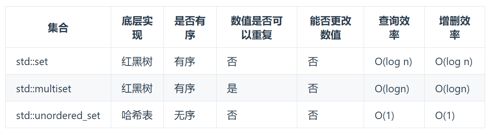
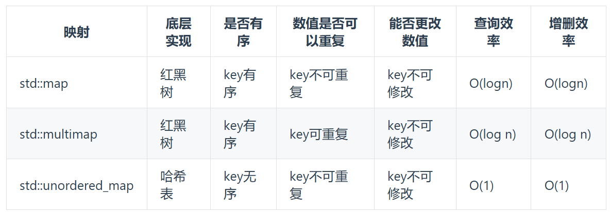

* 头文件
```C++
  #include<iostream>
  #include<vector>
  #include<algorithm>
  #include <string>
  #include <sstream>
  using namespace std;
```
## 一、数组
### （0）输入输出
```C++
    vector<int> arr;
    int input;
    do {
        cin >> input;
        arr.push_back(input);
    } while (getchar() != '\n' ); 

     while (cin >> element) {
        arr.push_back(element); // 将输入的元素添加到vector中
    }

    // 传参
    int search(vector<int>& nums, int target) 

    // 事先知道数组长度
    int arr[10];
    // 赋初值
    int arr[10] = {0,1,2,3,4,5,6,7,8,9};
    int arr[] = {1,2,3};
    vector<int> arr = {1,2,3};
```

### （1）二分查找
* 题目：有序数组。每次选取中间的元素 x 进行比较。target>x则去左边找，target\<x则去右边找。
```C++-
int search(vector<int>& nums, int target) {
    int left=0;
    int right=nums.size()-1;
    while(left<=right){  // 条件是<=
        int mid=(left+right)/2;   // 每次/2
        if(nums[mid]==target){
            return mid;
        }
        else if(nums[mid]>target){
            right=mid-1;
        }
        else{
            left=mid+1;
        }
    }
    return -1;
}
```
### (2) 原地移除元素
* 题目：原地移除数组中所有值为target的数，并返回数组新长度。
* 解法：双指针 - 快慢指针。fast指向的数如果不等于target，就放到前面。最后返回slow。

### (3) 有序数组平方
* 题目：非递减数组。返回每个元素的平方组成的新数组，也按非递减排序。
* 解法：双指针。从两头向中间逼近，每次比较两者大小并将平方值放入新数组。

### (4) 长度最小的子数组
* 题目：给定一个数组，找出该数组中满足和>=target的长度最小连续子数组。返回其长度。
* 解法：双指针 - 类似滑动窗口。right++直到窗口内满足条件（先找到满足的窗口），left++找到最小窗口（因为有可能左边++之后仍满足条件）。right再++直到最后。
```C++
int search(vector<int>& arr,int s){
    int min=arr.size();
    int left=0,right=0;
    int sum=0;
    while(right<arr.size()){
        sum+=arr[right];
        if(sum>=s){ // 如果满足条件
            while(sum-arr[left]>=s){ // 把窗口缩到最小
                left++;
                sum-=arr[left];
            }
            int tmp=right-left+1;
            if(tmp<min){
                min=tmp;
            }
        }
        right++;
    }
    if(min==arr.size()+1){
        return 0;
    }
    return min;
}
```
### (5) 快排
* quicksort：在仍有2个及以上的数未排序时，归位mid并排其左右
* partition：从右边开始，右边比key大，j--，左边比key小于等于，i++，总之就是左右交换。
```C++
int Partition(vector<int>& arr, int l, int r) {
    int i = l, j = r;
    int key = arr[i];
    while (i < j) {  // 当 i == j 时说明已找到正确位置
        while (i < j && arr[j] > key) {
            j--;
        }
        if (i < j) {
            int temp = arr[i];
            arr[i++] = arr[j];
            arr[j] = temp;
        }
        while (i < j && arr[i] <= key) {
            i++;
        }
        if (i < j) {
            int temp = arr[i];
            arr[i] = arr[j];
            arr[j--] = temp;
        }
    }
    return i;
}

void QuickSort(vector<int>& arr, int left, int right) {
    int mid;
    if (left < right) {
        mid = Partition(arr, left, right); // 归位一个
        QuickSort(arr, mid + 1, right);
        QuickSort(arr, left, mid - 1);
    }
}

```
### （6）堆
```C++
每一个堆中： 
    父节点： i = len/2 -1
    儿子节点： son = i*2 + 1
    儿子的右兄弟： son + 1
```
* HeapSort: 获取长度，建初始堆，循环 { 最大的放到最后，调整使成为大顶堆 }
* buildMaxHeap：从最后一个父节点开始往前调整每一个小树，先比较小孩结点，再比较小孩结点和爹结点，直到 i = 0
```C++
void buildMaxHeap(vector<int>& arr,int dad,int end){
    int son;
    for(int i=dad;i>=0;i--){
        son=i*2+1;
        // 找出最大的兄弟
        if(son+1<=end && arr[son]<arr[son+1]){  // 如果右兄弟存在且右兄弟更大
            son++;
        }
        // 最大的兄弟和爹比
        if(son<=end && arr[i]<arr[son]){  // 找出三个中最大的
            swap(arr[i],arr[son]);   
        }
    }
}

void HeapSort(vector<int>& arr){
    int len = arr.size();
    buildMaxHeap(arr, len/2-1, len-1);
     for(int i=len-1;i>0;i--){   // i表示数组长度
        swap(arr[i],arr[0]);  // 把最大的放到最后
        buildMaxHeap(arr,i/2-1,i-1); // 同上
    }

}

```

---------------------------------

## 二、链表
### （0）输入输出
```C++
// 定义
struct ListNode {
    int val;
    ListNode* next;

    ListNode():val(0),next(nullptr){}
    ListNode(int x): val(x),next(nullptr){}
    ListNode(int x, ListNode *next) : val(x), next(next) {}
};
    // 输入并构造单链表
    ListNode* head=new ListNode();
    ListNode* p=head;  // 空头结点
    int num;
    do {
        cin>>num;
        p->next=new ListNode(num);
        p=p->next;
    }while (getchar()!='\n');

    // 删除某个节点
    delete p;
```

### （1）删除节点
* 题目：删除单链表中所有值为 target 的结点
* 解法：就删就行，每次检查当前节点的下一个值是否为target

### （2）反转链表
* 题目：将单链表原地反转
* 解法：先转向，再后移
```C++
ListNode* reverseList(ListNode* head) {
    ListNode* temp;
    ListNode* pre=nullptr;
    ListNode* cur=head;
    while(cur){
        temp=cur->next;

        cur->next=pre;
            
        pre=cur;
        cur=temp;
    }
    return pre;
}
```

### (3)合并有序链表
* 题目：将两个有序链表合并为一个大链表
* 解法：如果某一个链表走完了，则将另一个链表添加到尾部，递归地去合并剩余链表
```C++
ListNode* trainningPlan(ListNode* l1, ListNode* l2) {
    if(l1==nullptr){
        return l2;
    }
    if(l2==nullptr){
        return l1;
    }

    struct ListNode* pre=NULL;
    if(l1->val<l2->val){
        pre=l1;
        pre->next=trainningPlan(l1->next,l2);
    }
    else{
        pre=l2;
        pre->next=trainningPlan(l1,l2->next);
    }
    return pre;
}
```

## 三、字符串
### （0）输入输出
```C++
    // 输入若干行字符串
    vector<string> ops;
    while(getline(cin,line)){  // 输入若干行字符串
        if(line.empty()){
            break;
        }
        ops.push_back(line); // 放入vector
    }
    ops[0]; // vector内字符串

    // 按空格分割字符串
    string substring; // 子串
    vector<string> ops; // 分割后的单词向量

    istringstream iss(line); // 使用字符串流来处理输入的字符串
    while (iss >> substring) { // 逐个单词读取
        ops.push_back(substring); // 将单词添加到向量中
    }

    // 遍历ops中的字符串
    for (const auto& op : ops) {
        cout<<op<<endl;
    }

    // 一些计算
    len=a.length();  
    a.substr(i,len); // 求从第i个字符开始，长度为len的子串
    a.compare(b); // a与b作比较，0相等，1不等（注意！！！！）
    int n=stoi(s); // 字符串转int型
    reverse(s.begin(),s.end());
    reverse(s.begin()+i,s.end()+i+k); // 后面这个位置的字符是不参加反转的

    // A=65,a=97,随字母顺序递增
```
### （1）反转字符串升级版
* 题目：每计数至 2k 个字符，反转其中前 k 个字符。少于k个则全部反转，否则反转前k个
* 解法：使用reverse即可。 每次对i之后的2k个字符进行处理

### （2）按单词反转
* 题目：以单词为单位进行反转
* 解法：
* * ① 去除头尾 + 单词中间的多余空格（借助双指针），fast用于找字母，slow管理放入新字符串。注意最后有空格的情况。
* * ② 大反转 
* * ③ 单词内部反转
```C++
void removeSpace(string &s) {
    int slow = 0, fast = 0;
    while (fast < s.length()) {
        if (s[fast] != ' ') { // 一旦遇到不为空格的，则处理
            s[slow++] = s[fast];
            if (s[fast + 1] == ' ' && fast != s.length() - 1) {// 加后面这个判断是因为有可能是最后一个单词了
                s[slow++] = ' ';
            }
        }
        if (fast == s.length() - 1 && s[fast] == ' ') {
            slow--; // 因为slow这里只有一个空格
        }
        fast++;
    }
    s.resize(slow);
}

```

### （3）KMP-查找子串位置（返回子串下标）
* findByKMP：获取子串的next数组,之后使用下标 i 遍历 a 数组
```C++
for (i = 0; i < a.length(); i++) {
    if (a[i] == b[j]) {  // 如果相等
        j++;  // j后移
        if (j == b.length()) { // 已经匹配成功
            return i - j + 1;
        }
    } 
    else { // 不相等则重置i和j
        if(j!=0){
            j = next[j-1];  // 重置j
            i--;   // 重置i
        }     
        // j == 0 的情况是，第一个就没有匹配上，因此此时也不需要 i--
    }
}
```
* getNext：生成b的next数组
```C++
int* getNext(const string b){
    int* next=new int[b.length()];
    next[0]=0;
    for(int i=1;i<b.length();i++){  // 遍历b
        int j = next[i-1]; // 取需要比较的上一个节点的前缀字符串
        while(j > 0 && b[i] != b[j]) { // 不等则不断找更前面的前缀字符串
            j = next[j-1];
        }
        if (b[i] == b[j]) { // 匹配
            next[i] = j + 1;
        } else {
            next[i] = 0; // 完全不匹配的情况
        }
    }
    return next;

}
```


## 四、栈与队列
### (0) 输入输出
```C++
#include<stack>
stack<char> sta;
```

### (1) 括号匹配
* 直接看代码：
```C++
bool isValid(string s){
    stack<char> sta;
    
    for (int i = 0; i < s.size(); i++) {
        // ---如果是左括号，则入栈（入相反的方便比较
        if(s[i]=='('){
            sta.push(')');
        }
        else if(s[i]=='['){
            sta.push(']');
        }
        else if (s[i]=='{')
        {
            sta.push('}');
        }
        // ---如果是右括号
        // 如果栈是空的或括号未匹配
        else if (sta.empty()||s[i]!=sta.top()){
            return false;
        }
        // 如果括号匹配
        else{
            sta.pop();
        }
    }
    return sta.empty();
}
```
## 五、二叉树
### （0）输入输出
```C++
    struct TreeNode {
        int val;
        TreeNode* left;
        TreeNode* right;
        TreeNode(int _val):val(_val),left(nullptr),right(nullptr){}
    };

    TreeNode* root=new TreeNode();  // 可以加参数

```
### （1）遍历 - 递归
* 前、中、后序遍历
```C++
void traversalPre(TreeNode* root,vector<int>& res){
    if(root==NULL){
        return;
    }
    res.push_back(root->val);  // 中，什么序遍历取决于这一行放在哪，仅此而已
    traversalPre(root->left,res);  // 左
    traversalPre(root->right,res);  // 右

}

vector<int> preorderDG(TreeNode* root){
    vector<int> res;
    traversalPre(root,res);
    return res;
}
```
### （2）遍历 - 非递归

### （3）遍历 - 层序
```C++
vector<vector<int>> levelOrder(TreeNode* root){
    vector<vector<int>> res;
    queue<TreeNode*> que;
    if(root!=NULL){
        que.push(root);
    }
    while (!que.empty())
    {
        vector<int> childres;
        int size=que.size();  
        for(int i=0;i<size;i++){ // 遍历现在队列中（所处同一层级）所有节点的孩子
            TreeNode* node=que.front();
            que.pop();
            childres.push_back(node->val);
            // 左右孩子入栈
            if(node->left){que.push(node->left);}
            if(node->right){que.push(node->right);}
        }
        res.push_back(childres); // 一层结束
    }
    return res;
}
```

### （4）中序 + 前序建树

### （5）中序 + 后序建树

## 八、哈希表
### 基础知识


* 基本用法：
  ```C++
  //unordered_set: 
  #include<unordered_set>
  声明：unordered_set<int> s_num1(nums1.begin(),nums1.end());
  寻找：s_num1.find(num)!=s_num1.end();
  插入：res.insert(num);
  删除：res.erase(num);
  其他：.empty();.size()

  //unordered_map:

  ```

## 其他
### LRU
使用双向链表，key，value，unordered_map实现
* node结构体
* class LRUcache
* * private：unordered map<int,value>，头，尾，size，容量
* * public：
* * * 构造函数（上面的都照顾一下）
* * * get(key): 不在返回 -1，在则找到对应结点，remove，addhead，return value；
* * * put(key,value)：不在 new 一个 addhead，如果超容量则removeNode(t_node); cache.erase(t_node->key); delete(t_node);  如果在则重新赋值，remove，addhead
* * * remove(node)：node->pre->next=node->next;
                    node->next->pre=node->pre;
* * * addHead(node)：node->pre=head;
        node->next=head->next;
        head->next->pre=node;
        head->next=node;
        

        啊啊啊


